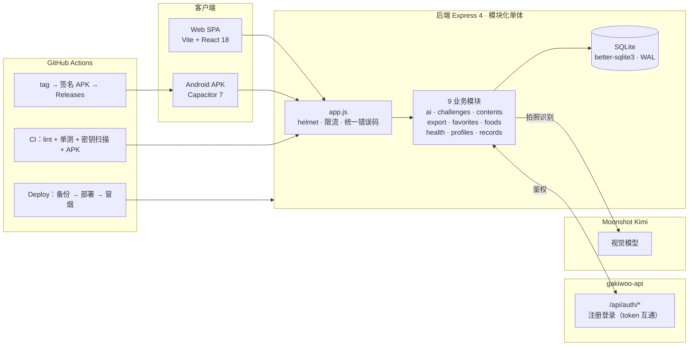

# 食刻 FoodCalorie

**拍照识别食物卡路里的健康饮食记录 App** —— 全栈自研，覆盖 Android APK 与 Web 双端。拍一张餐食照片，AI（Kimi 视觉模型）自动识别食物与热量；结合每日目标、周月趋势与打卡挑战，帮你轻松掌握每一餐的营养比例。账号与 [gakiwoo.com](https://gakiwoo.com) 主站互通，一处注册、多端登录。

[](https://github.com/Gakiwoo/foodcalorie/actions/workflows/ci.yml)
[](https://github.com/Gakiwoo/foodcalorie/releases)
[](./LICENSE)

## 预览

> 截图取自生产环境。

|             首页（今日记录）             |            我的页（数据/设置）            |
| :--------------------------------------: | :----------------------------------------: |
|        |              |
|             **记录页**             |              **发现页**              |
|  |  |

## 功能特性

- **AI 拍照识别**：Kimi 视觉模型识别餐食，输出热量/蛋白质/碳水/脂肪；未配置 Key 或识别失败时自动降级为食物库候选推荐，可用性不受影响
- **记录与统计**：今日摄入进度环、日/周/月报表、月历热力、目标达标天数；按日期/餐次管理记录，支持编辑删除
- **食物库**：内置常见中餐食物营养数据，支持关键字/分类搜索分页
- **收藏与内容**：食物/文章/食谱收藏；发现页内容流与详情
- **挑战打卡**：参与挑战、每日打卡、连续天数（streak）与积分激励
- **数据导出**：个人记录一键导出 CSV（含 Excel 公式注入防护）/ JSON
- **设置中心**：目标热量、饮食偏好、热量/重量单位（kcal↔kJ、g↔oz 实时换算）、识别精度、通知偏好
- **双端交付**：Web SPA + Android APK，同一份代码；APK 由 CI 构建并正式签名发布到 GitHub Releases

## 技术栈

| 层     | 技术 |
| ------ | ---- |
| 前端   | Vite 8 · React 18 · react-router-dom 7 · 设计令牌 + 组件库（`src/ui`）· vitest + Testing Library |
| 移动端 | Capacitor 7 Android（`com.shike.app`，minSdk 23 / Android 6.0+） |
| 后端   | Node 24 · Express 4 · better-sqlite3 · zod 校验 · pino 日志 · multer 2（上传） |
| 认证   | 复用 gakiwoo 主站账号体系（`/api/auth/*`），httpOnly Cookie + Bearer 双通道 |
| AI     | Moonshot Kimi 视觉模型（可降级） |
| 工程   | GitHub Actions（CI / 签名发布 / 自动部署）· PM2 · nginx · ESLint · node:test |

## 架构



- **后端**：模块化单体，9 个模块均为 Controller / Service / DAO 三层；横切关注点（鉴权、限流、校验、错误序列化、时区、私有图片存储）收口在 `src/shared/`
- **前端**：32 个页面组件，设计令牌（`src/ui/theme.js`）+ 页面原语组件统一视觉；API 层统一封装（401 单飞刷新、GET 智能重试、错误码映射）
- **账号体系**：与主站共用注册登录，业务库仅以 `user_id` 关联用户，不存储密码

## 目录结构

```
foodcalorie/
├── frontend/                 # Vite + React 18（32 个页面组件）
│   ├── App.jsx               # 路由表（懒加载 + 页面标题 + 导航栈）
│   ├── FoodCalorie-*.jsx     # 页面组件（真实数据驱动）
│   ├── src/api/              # client.js（统一请求/401 自愈/重试）+ auth.js
│   ├── src/ui/               # theme.js 设计令牌 + components/ 原语 + hooks + 三态组件
│   ├── src/test/             # vitest 页面冒烟套件（34 文件 / 376 用例）
│   ├── android/              # Capacitor 原生工程（com.shike.app）
│   └── scripts/              # APK 构建与 E2E 验证脚本
├── backend/                  # Express 分层（Controller/Service/DAO）
│   ├── src/modules/          # 9 业务模块
│   ├── src/shared/           # 中间件（鉴权/限流/校验/错误）+ 工具 + 私有图片存储
│   ├── test/                 # node:test 单测（11 文件 / 58 用例）
│   └── SPEC.md               # 需求规格
├── docs/                     # 结构索引 / 发布手册 / Release notes
├── ops/                      # nginx / sshd / 备份 运维配置模板
└── scripts/                  # 仓库级脚本（密钥扫描 / 版本号同步）
```

## 快速开始

前置条件：**Node.js ≥ 24**（见 `.nvmrc`；better-sqlite3 为原生模块，运行时版本需与安装时一致）、npm ≥ 10。

```bash
# 后端（默认 http://127.0.0.1:3001）
cd backend
cp .env.example .env        # 按注释填写
npm install
npm run dev                 # nodemon 热重载

# 前端（默认 http://localhost:5173，/api/* 自动代理）
cd frontend
npm install
npm run dev
```

浏览器访问 `http://localhost:5173`，注册登录后即可使用全部功能。

## 环境变量

后端完整模板见 [`backend/.env.example`](./backend/.env.example)：

| 变量 | 说明 |
| ---- | ---- |
| `PORT` / `HOST` | 监听地址（生产默认仅本机监听，由 nginx 反代对外） |
| `NODE_ENV` | `production` 触发密钥守卫、CORS 强校验等 fail-closed 检查 |
| `JWT_SECRET` | 登录态签名密钥（生产必配，长度 ≥ 16，占位值拒绝启动） |
| `DB_PATH` | SQLite 文件路径（默认 `./data/foodcalorie.db`） |
| `CORS_ORIGINS` | 逗号分隔白名单；生产未配置时拒绝启动 |
| `REDIS_URL` | 可选。配置后限流改用 Redis 滑动窗口（多实例共享），故障自动回退内存 |
| `MOONSHOT_API_KEY` | Kimi 视觉模型 Key（缺省时 AI 降级为候选推荐） |
| `UPLOAD_DIR` | 私有上传目录（图片仅能通过鉴权 API 读取，nginx 层同步禁暴露） |
| `SWAGGER_ENABLED` | 生产 Swagger 开关（`/api/docs`，默认关） |
| `AI_BACKFILL_ENABLED` | 模型识别结果回灌公共食物库开关（默认关） |

## API 概览

- 业务前缀：`/api/v1/foodcalorie/*`；认证：`/api/auth/*`（复用主站）
- 统一响应：`{ code, message, data }`；错误码分段（1xxxx 参数 / 2xxxx 鉴权 / 3xxxx 记录 / 4xxxx 内容收藏 / 5xxxx 统计导出）
- 模块：`health`（探活）· `records`（记录 CRUD + 统计 + 月历）· `foods`（食物库搜索）· `ai`（拍照识别 + 私有图片）· `favorites` · `contents` · `challenges` · `profiles` · `export`
- 生产 Swagger：`SWAGGER_ENABLED=true` 时 `/api/docs` 可用

## 测试与质量

```bash
# 后端（node:test，58 用例：CRUD / 统计口径 / 并发防重 / 跨用户隔离 / 上传与限流安全）
cd backend && npm run lint && npm test

# 前端（vitest，34 文件 / 376 用例：31 页面冒烟 + 单元）
cd frontend && npm run lint && npm test

# 端到端（连 dev server 的功能回归脚本 + 生产冒烟）
cd frontend/scripts && node verify_m14.cjs
```

CI（`.github/workflows/ci.yml`）在每次 push/PR 运行 4 个 job：**security**（密钥扫描）、**backend**（lint + 单测 + 依赖审计）、**frontend**（lint + 单测 + 构建 + 审计）、**android-debug**（构建 APK artifact）。

## 构建与发布

### Web

```bash
cd frontend && npm run build   # base './'，产物 dist/
```

### Android APK

推荐由 CI 构建：推送 `v*` tag 自动触发 `android-release` job——从 Secrets 还原 keystore → `gradlew assembleRelease` 正式签名 → 上传到 GitHub Releases；同时 `android-debug` 产出 debug APK artifact。

本机构建（可选）：需 JDK 21 + Android SDK，`npm run build:apk` → `npx cap sync android` → `./gradlew assembleDebug`。签名凭据经 `FC_RELEASE_*` 环境变量注入（见 `apk.env.example`），不落任何 tracked 文件。

完整发布门禁与步骤见 [`docs/RELEASE_PLAYBOOK.md`](./docs/RELEASE_PLAYBOOK.md)。

## 部署

生产拓扑：单台云服务器，nginx 对外（Web 静态 + `/api` 反代），后端 PM2 仅监听本机回环；`/uploads/` 在 nginx 层硬性 404，图片一律走鉴权 API。

- **自动部署**：`Deploy` workflow（手动触发或推 tag）——构建前后端产物 → 服务器自动备份（保留 5 份）→ 解压安装 → `pm2 restart` → 健康检查冒烟，失败即中止可回滚；部署完成后写 `RELEASE_SHA` 标记线上版本
- **回滚**：使用服务器备份目录还原后 `pm2 restart`（见 `ops/backup/README.md`）

运维配置模板（nginx 站点 / sshd 加固 / 备份脚本）见 [`ops/`](./ops/)。

## 下载安装（Android）

最新 APK 在 [GitHub Releases](https://github.com/Gakiwoo/foodcalorie/releases) 获取（当前 `v1.0.6`，release 正式签名）：

1. 下载 Release 附件中的 `app-release.apk`
2. 传到 Android 手机（微信/网盘/数据线均可），点击安装
3. 系统提示「未知来源」时，允许安装后继续
4. 打开「食刻」，使用邮箱注册或登录（与 Web 端账号互通）

> - v1.0.6 起为正式签名；此前安装过 debug 签名旧版的用户需先卸载再安装（签名不同无法覆盖升级）
> - 最低支持 Android 6.0（minSdk 23）

## 安全设计

- **访问控制**：所有业务查询强制带 `user_id` 过滤（IDOR 防护）；JWT 显式限定 HS256；登录态走 httpOnly Cookie（前端 token 不落 localStorage）
- **上传安全**：multipart 大小限制 + 文件魔数校验（拒绝伪装扩展名）+ 私有图片所有权校验，图片仅能由所有者经鉴权 API 读取
- **注入防护**：全量参数 zod 校验与 SQL 预编译；CSV 导出带公式注入防护
- **限流与降级**：全局写/读限流 + AI/导出独立限流，内存滑窗，可插拔 Redis 共享存储（故障回退内存）
- **配置安全**：生产环境密钥缺失/占位、CORS 白名单未配置均拒绝启动；CI 内置密钥扫描；仓库零凭据
- **传输与响应头**：全站 HTTPS + HSTS，helmet 安全头

## 文档索引

- [`docs/PROJECT_STRUCTURE.md`](./docs/PROJECT_STRUCTURE.md) — 文件结构索引（维护首选）
- [`backend/SPEC.md`](./backend/SPEC.md) — 需求规格
- [`docs/RELEASE_PLAYBOOK.md`](./docs/RELEASE_PLAYBOOK.md) — 发布手册（门禁/流程/回滚）
- [`docs/release-notes-v1.0.6.md`](./docs/release-notes-v1.0.6.md) — 最新 Release notes
- [`backend/README.md`](./backend/README.md) — 后端开发与运维手册
- [`ops/README.md`](./ops/README.md) — 运维基线（Node/SSH/签名/私有上传）

## Contributing

1. Fork 本仓库并创建特性分支
2. 提交变更（提交信息遵循 `feat:` / `fix:` / `docs:` / `chore:` 约定）
3. 发起 Pull Request，CI 全绿后合并

## License

[MIT](./LICENSE) · Copyright © 2026 Gakiwoo
