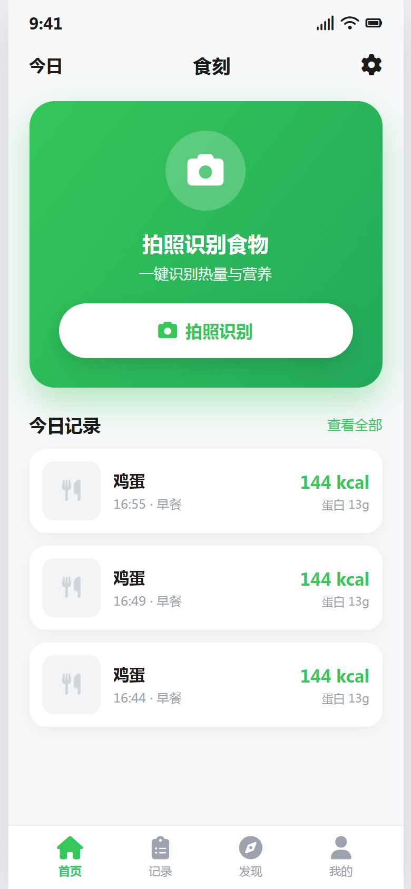
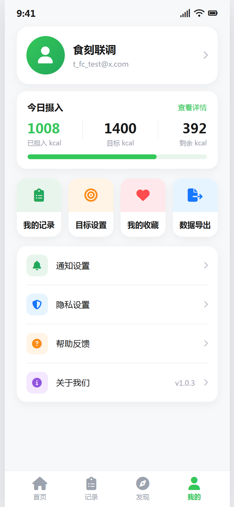
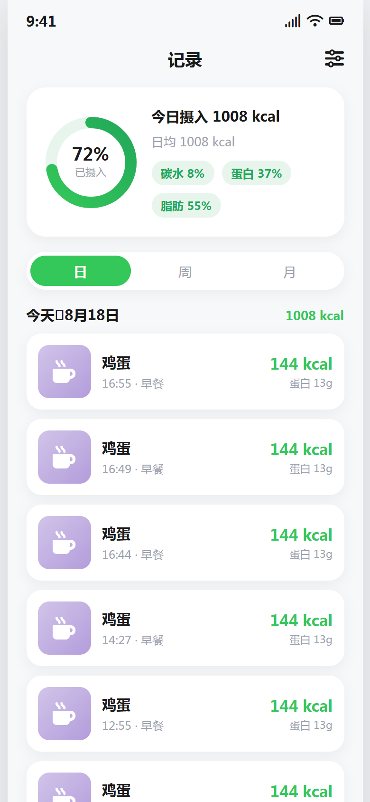
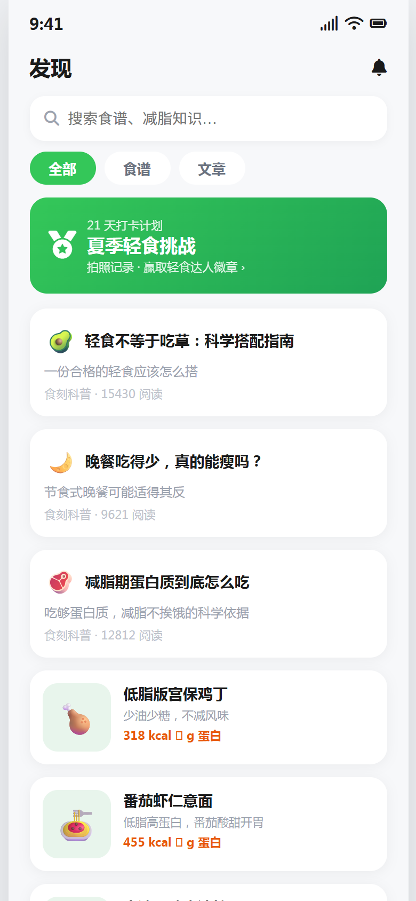
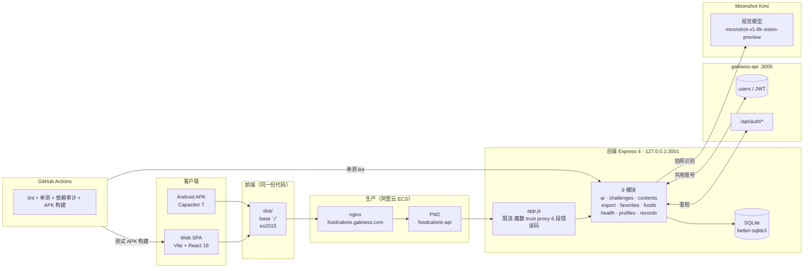

# 食刻 FoodCalorie

**拍照识别食物卡路里的健康饮食记录 App** —— 全栈自研，覆盖 Android APK 与 Web 双端。拍一张餐食照片，AI（Kimi 视觉模型）自动识别食物与热量；结合每日目标、周月趋势与打卡挑战，帮你轻松掌握每一餐的营养比例。后端与 [gakiwoo.com](https://gakiwoo.com) 共用账号体系，一处注册、多端通用。


## 预览

> 截图取自生产环境（2026-08-18，v1.0.4 代码，含 MasterGo 设计稿还原）。

|             首页（今日记录）             |            我的页（数据/设置）            |
| :--------------------------------------: | :----------------------------------------: |
|        |              |
|             **记录页**             |              **发现页**              |
|  |  |

## Table of Contents

- [预览](#预览)
- [功能特性](#功能特性)
- [技术栈](#技术栈)
- [架构](#架构)
- [目录结构](#目录结构)
- [前置条件](#前置条件)
- [本地开发](#本地开发)
- [环境变量](#环境变量)
- [API 概览](#api-概览)
- [测试](#测试)
- [构建](#构建)
- [部署](#部署)
- [下载与安装（Android APK）](#下载与安装android-apk)
- [文档索引](#文档索引)
- [License](#license)

## 功能特性

- **AI 拍照识别**：Kimi 视觉模型（`moonshot-v1-8k-vision-preview`）识别餐食，输出热量/蛋白质/脂肪/碳水；未配置 Key 时自动降级为食物库候选推荐
- **记录与统计**：今日摄入进度环、周/月报表、目标达标天数；按日期/餐次管理记录，支持编辑删除
- **食物库**：精选常见食物营养数据（支持搜索与分类）；AI 识别结果可审核后回灌（`AI_BACKFILL_ENABLED` 显式开启）
- **收藏与内容**：食物/文章/食谱收藏；发现页内容流
- **挑战打卡**：连续打卡激励
- **数据导出**：JSON / CSV 一键导出个人记录
- **双端交付**：Web SPA（React）+ Android APK（Capacitor，包名 `com.shike.app`；当前提供 debug 签名构建）
- **生产安全**：限流（写 30/min · 读 120/min · AI 5/min，Redis 多实例共享，故障回退内存）、上传魔数校验、密钥守卫、时区统一（北京时间）、`trust proxy`、CORS 白名单

## 技术栈

| 层     | 技术                                                                                           |
| ------ | ---------------------------------------------------------------------------------------------- |
| 前端   | Vite 8 · React 18 · react-router-dom 7 · font-awesome 本地打包（零 CDN）                    |
| 移动端 | Capacitor 7 Android（`com.shike.app`；APK 由 GitHub Actions CI 构建并发布到 Releases）       |
| 后端   | Node 24 · Express 4 · better-sqlite3 · zod 校验 · pino 日志 · multer 2（上传）            |
| 认证   | 复用 gakiwoo 账号体系（`/api/auth/*`，token 互通）                                           |
| AI     | Moonshot Kimi 视觉模型（可降级）                                                               |
| 部署   | 阿里云 ECS · PM2 · nginx 独立子域（`https://foodcalorie.gakiwoo.com`）· GitHub Actions CI |

## 架构



> **已知架构约束**：食刻后端与 gakiwoo-api 共享同一 SQLite 文件与 `JWT_SECRET`（业务库直接读其 `users` 表，无外键），账号体系零成本复用的代价是两服务 schema/部署互相耦合，且 SQLite 多进程写并发有上限——这是有意为之的务实取舍，不支持水平扩展；若未来需要独立扩容，应把用户/认证域显式服务化。

## 目录结构

```
foodcalorie/
├── frontend/                 # Vite + React 18（31 个页面组件）
│   ├── App.jsx               # 路由表（全站导航已收敛为组件内 onClick）
│   ├── FoodCalorie-*.jsx     # 页面组件（真实数据 / 数据驱动渲染）
│   ├── src/api/              # client.js（统一 baseURL/鉴权/401 自愈）+ auth.js
│   ├── src/ui/               # common（状态栏/环图）+ toast
│   ├── android/              # Capacitor 原生工程（com.shike.app）
│   ├── scripts/              # 构建与 E2E（build-apk.sh / verify_*.cjs）
│   └── vite.config.js        # base './'（Web/APK 双兼容）+ dev proxy → 服务器
├── backend/                  # Express 分层（Controller/Service/DAO）
│   ├── src/modules/          # 9 模块：ai/challenges/contents/export/favorites/foods/health/profiles/records
│   ├── src/shared/           # 限流/错误码/中间件
│   ├── test/                 # node:test 单测（58 用例，覆盖安全/并发/跨用户隔离）
│   ├── .env.example          # 环境变量模板
│   ├── SPEC.md               # 需求规格
│   └── ASSESSMENT.md         # 完成度评估与遗留项
├── docs/                     # PROJECT_STRUCTURE.md / pages-inventory.md / README.md
├── ops/                      # nginx / sshd 运维配置
├── archive/                  # 归档区（原型/脚本，只读参考）
└── scripts/                  # 仓库级脚本（check-secrets.mjs 等）
```

## 前置条件

- **Node.js ≥ 24**（建议 `.nvmrc` = `24.14.0`；`better-sqlite3` 为原生模块，运行时版本必须一致）
- npm ≥ 10
- （仅本机 APK 构建）JDK 21 + Android SDK（`build-tools` 34+/`platforms;android-34`）；**推荐直接使用 GitHub Actions 构建**（见 [构建](#构建)）

## 本地开发

```bash
# 后端（默认 http://127.0.0.1:3001）
cd backend
cp .env.example .env        # 按需填写（JWT_SECRET 需与 gakiwoo-api 一致才可登录）
npm install
npm run dev                 # nodemon 热重载

# 前端（默认 http://localhost:5173）
cd frontend
npm install
npm run dev                 # vite dev，/api/* 自动代理到服务器
```

浏览器访问 `http://localhost:5173` 即可。注册登录走 gakiwoo 账号体系。

## 环境变量

后端完整变量见 [`backend/.env.example`](./backend/.env.example)，核心项：

| 变量                    | 说明                                                                            |
| ----------------------- | ------------------------------------------------------------------------------- |
| `PORT` / `HOST`     | 服务监听（生产收敛为`127.0.0.1:3001`）                                        |
| `NODE_ENV`            | `production` 时触发密钥守卫与全局限流                                         |
| `JWT_SECRET`          | **必须与 gakiwoo-api 完全一致**（token 互通）                             |
| `DB_PATH`             | SQLite 路径（生产与 gakiwoo-api 指向同一库，共享 users 表）                     |
| `CORS_ORIGINS`        | 逗号分隔白名单（Web/`https://localhost`/`capacitor://localhost`）           |
| `REDIS_URL`           | 可选。配置后限流改用 Redis 滑动窗口（多实例共享计数），未配置或故障自动回退内存 |
| `MOONSHOT_API_KEY`    | Kimi 视觉模型 Key（缺失则 AI 降级为候选推荐）                                   |
| `UPLOAD_DIR`          | 私有上传目录（图片仅鉴权 API 可读）                                             |
| `SWAGGER_ENABLED`     | 生产 Swagger 文档开关                                                           |
| `AI_BACKFILL_ENABLED` | 模型结果回灌公共食物库开关（默认关）                                            |

## API 概览

- 统一前缀：业务 `/api/v1/foodcalorie/*`，认证 `/api/auth/*`（复用 gakiwoo-api）
- 统一响应：`{ code, message, data }`；6 段错误码（1xxxx 参数 / 2xxxx 鉴权 / 3xxxx 业务 / 4xxxx 权限 / 5xxxx 系统 / 9xxxx 内部）
- 9 个业务模块：`health`（探活）· `records`（记录 CRUD + 统计）· `foods`（食物库/搜索）· `ai`（拍照识别）· `favorites`（收藏）· `contents`（文章/食谱）· `challenges`（挑战打卡）· `profiles`（个人目标）· `export`（数据导出）
- 生产 Swagger：`SWAGGER_ENABLED=true` 时 `/api/docs` 可用

## 测试

```bash
# 后端单测（58 用例，需 Node 24）
cd backend && npm test

# 前端单元（vitest，34 文件 / 376 用例）
cd frontend && npm test

# 前端 E2E（连 dev server，16 个脚本：verify_m7/m8/.../m14 + 3b/3c 冒烟 + prod）
cd frontend/scripts && node verify_m14.cjs    # 例：AI 识别闭环

# 生产 E2E（连 https://foodcalorie.gakiwoo.com，8 项断言）
node verify_prod.cjs
```

CI（GitHub Actions `.github/workflows/ci.yml`）覆盖：密钥扫描（`check-secrets.mjs`）、后端 lint + 单测 + 依赖审计、前端 lint + 构建 + 单元测试。

## 构建

### Web 产物

```bash
# base './'（Web 与 APK 双兼容；dist/ 不入库）
cd frontend && npm run build
```

### Android APK（推荐：GitHub Actions）

每次推送到 `main`，CI（`.github/workflows/ci.yml` 的 `android-debug` job）自动：
`npm run build:apk` → `cap sync android` → `gradlew assembleDebug`，并将 APK 上传为 **CI artifact**；发布到 Releases 见下方 [下载与安装](#下载与安装)。

### Android APK（本机可选）

```bash
cd frontend/android
# 需 JDK 21（Capacitor 7 必须）与 Android SDK；gradle 缓存用项目内 GRADLE_USER_HOME=.gradle-home
export JAVA_HOME="<JDK 21 安装路径>"
export GRADLE_USER_HOME="<项目根>/.gradle-home"
./gradlew assembleDebug --no-daemon   # → android/app/build/outputs/apk/debug/app-debug.apk
```

> 说明：构建脚本 `scripts/build-apk.mjs` 自动注入 `VITE_API_ORIGIN=https://foodcalorie.gakiwoo.com`（纯源站地址，无路径后缀）、相对路径资源与 es2015 目标（兼容 Android 5.1+ WebView）。release 签名通过 `FC_RELEASE_*` 环境变量配置（keystore 密码），未配置时仅产出 debug 签名 APK。

## 部署

生产拓扑：阿里云 ECS · PM2（`foodcalorie-api`，监听 `127.0.0.1:3001`）· nginx 独立子域 `https://foodcalorie.gakiwoo.com`（前端静态 + `/api/v1/foodcalorie/*` 反代；**`/uploads/` 在 nginx 层硬性 404**，图片仅经鉴权 API `/api/v1/foodcalorie/ai/images/:filename` 读取，见 `ops/nginx/`）。

标准发布流程（详见 [`backend/README.md`](./backend/README.md) 与 [`docs/README.md`](./docs/README.md)）：

1. 本地构建（前端 `npm run build` / 后端打包 src+test）
2. 服务器备份（`cp -r` 至 `*-backup-YYYYMMDD`）
3. scp 上传 → 解压 → `npm install` → `pm2 restart foodcalorie-api`
4. 验证：后端单测 + 生产 E2E（`verify_prod.cjs`）+ 关键接口 curl

## 下载与安装（Android APK）

最新 APK 发布在 **GitHub Releases**：[Gakiwoo/foodcalorie Releases](https://github.com/Gakiwoo/foodcalorie/releases)

**下载指引：**

1. 打开 [Releases 页面](https://github.com/Gakiwoo/foodcalorie/releases)，选择最新版本（当前 `v1.0.6`）
2. 在「Assets」区域下载 APK 文件（命名规范：`app-release.apk`，正式签名版；历史 debug 版为 `foodcalorie-v1.0.4-debug.apk`）
3. 将 APK 传到 Android 手机（微信/网盘/数据线均可），点击安装
4. 系统提示「未知来源」时，允许安装来自该来源的应用（设置 → 安全 → 安装未知应用）

> **注意事项**
>
> - 自 v1.0.6 起发布 **release 正式签名** 构建（CI 自动签名上传）；历史版本为 debug 签名，升级需先卸载旧版
> - APK 内置生产 API 地址（`https://foodcalorie.gakiwoo.com`），安装即可使用，登录与 Web 端账号互通
> - 最小支持 Android 5.1+（minSdk 22）

## 文档索引

- [`docs/PROJECT_STRUCTURE.md`](./docs/PROJECT_STRUCTURE.md) — ★ 文件结构索引（维护首选）
- [`docs/pages-inventory.md`](./docs/pages-inventory.md) — 前端页面清单（路由/组件）
- [`backend/SPEC.md`](./backend/SPEC.md) — 原始需求规格
- [`backend/ASSESSMENT.md`](./backend/ASSESSMENT.md) — 完成度评估与遗留项
- [`ops/`](./ops/) — nginx / sshd 运维配置

## Contributing

1. Fork 本仓库
2. 创建特性分支（`git checkout -b feat/amazing-feature`）
3. 提交变更（`git commit -m 'feat: add amazing feature'`）
4. 推送分支（`git push origin feat/amazing-feature`）
5. 发起 Pull Request（CI 全绿后合并）

## License

[MIT](./LICENSE) · Copyright © 2026 Gakiwoo
